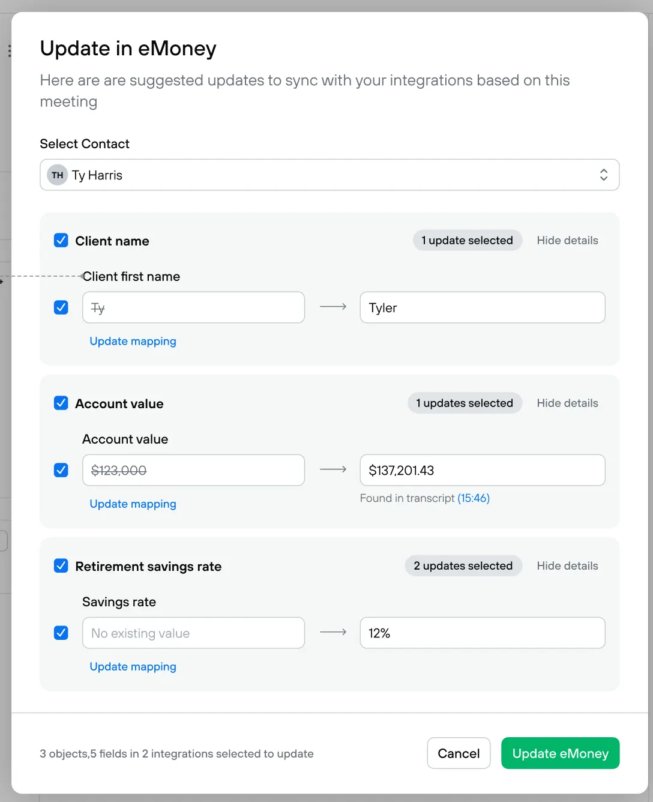

# New Requirements
## Existing functionality

- Allow logging in with Google (Already built)
    - Create a Google OAuth app and use the credentials it creates for the .env file
    - add [webshookeng@gmail.com](mailto:webshookeng@gmail.com) as an oauth test user to your Google OAuth app
    - I can connect multiple google accounts and it pulls in the events from all of their calendars ✅
    - I should be able to see the upcoming calendar events in the app and toggle a switch on whether or not I want a notetaker to attend that meeting ✅
- The app uses [recall.ai](http://recall.ai) to send a notetaker to the meetings on my calendar
    - Create a free account on Recall.ai, https://www.recall.ai/ to get an API key in the .env file
    - https://docs.recall.ai/docs/quickstart
    - When I connect my calendar or add an event to my calendar, the app should look for a zoom link somewhere in the calendar event and then make sure a recall bot joins the meeting a configurable (in settings) number of minutes before it starts ✅
- After the meeting, the meeting appears in the app in a list of past meetings
    - Each meeting should show attendees, start time, a logo for platform of the call (zoom, microsoft teams, google meet) ✅
- I can click on past meetings and:
    - View the full transcript of the meeting
    - View an AI-generated draft follow-up email (recaps what was talked about in the meeting) ✅

## New feature to add

- In settings, allow me to connect Hubspot using OAuth
    - Create a Hubspot OAuth app. They have a self serve developer portal.
- After you record a new meeting:
    - Allow me to open a modal where I can review suggested updates to a Hubspot contact
    - Show a search/select where I can search for a Hubspot contact
    - Use the Hubspot API to pull the contact record
    - Use AI to generate a list of suggested updates to the Hubspot record
        - For example, if the user mentioned “My phone number is 8885550000 it suggests updating their phone number in the CRM”
        
    - I should show the existing value in Hubspot and the AI suggested update to the field
    - The UI should for reviewing and submitting updates should look exactly like this. We’d like to see your ability to match a design perfectly.
- After reviewing the updates, I can click “Update Hubspot” and it will sync the updates to the selected Hubspot contact.